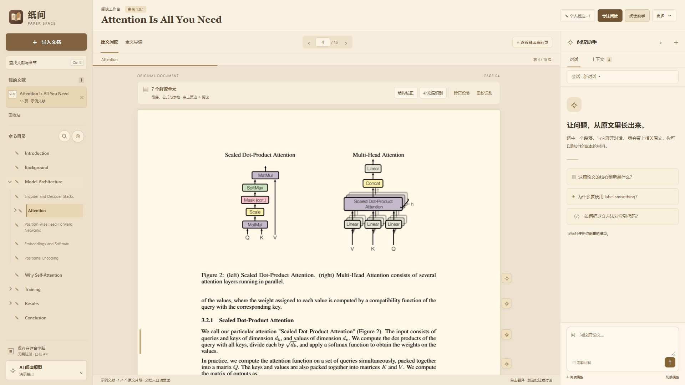

<p align="center"></p>

# 纸间 · Paper Space

**让问题，从原文里长出来。**

本机优先的 AI 论文阅读工作台。保留 PDF 原貌，把翻译、段落解读、章节批注和带来源的对话放在同一个阅读空间里。无需注册，AI 使用你自己的接口。

[](https://github.com/martin2026US-lab/paper-space/actions/workflows/test.yml)




▶ **[观看 58 秒 AI 功能宣传片](docs/assets/paper-space-ai-demo.mp4)** · [查看封面](docs/assets/cover.jpg)

## 可以做什么

- **原文先出现**：PDF 保留页面与文字层，版面识别在本机后台进行；支持 DOCX、TXT、Markdown。
- **围绕原文用 AI**：单击句子翻译，逐段解读，选区讨论，全文导读；对话前可查看与排除本轮材料，回答中的来源可回到原文。
- **章节式阅读**：分层目录、圆形章节转盘、快速查找、专注阅读；支持跨页段落、手动结构校正与疑似漏段提示。
- **留下自己的理解**：个人批注与章节对应，按文献保存多个独立对话，导出 Markdown 阅读笔记。
- **自配 AI 接口**：不内置对话大模型、不提供 API Key；支持 OpenAI 兼容 Chat Completions、Anthropic Messages 和兼容的本机模型接口。
- **暖纸色界面**：让阅读、翻译和旁注同时可见，减少窗口切换。

## 下载安装（推荐）

**[下载 Windows 安装包](https://github.com/martin2026US-lab/paper-space/releases/latest)** · [安装与升级说明](docs/INSTALL.md)

面向 Windows 10 / 11 x64，内置运行环境和离线识别模型。下载 Setup.exe 安装即可，无需配置 Node.js 或 Python。个人资料保存在用户目录，升级与卸载保留。AI 功能使用你自己的模型接口。

## 从源码运行（开发者）

需要 **Node.js 22+**。浏览器版不需要安装 npm 依赖，前端库已随源码附带。

```sh
git clone https://github.com/martin2026US-lab/paper-space.git
cd paper-space
npm start
```

打开 **http://127.0.0.1:4317**，导入自己的文档。可选：启动前运行 `npm run setup:demo` 下载公开的 *Attention Is All You Need* 示例。已经初始化的文献库可以直接导入下载后的 `public/demo.pdf`。

### Windows 桌面版（源码启动）

```sh
npm ci
npm run desktop
```

桌面版监听 `127.0.0.1:4319`，数据保存在项目的 `data/`。F12 打开开发者工具。源码方式的 Electron 首次安装需要联网；普通用户请使用上方安装包。主要验证平台为 Windows。

### 可选：本机 PDF 结构识别

未配置 Docling 时，仍可显示 PDF 原文和提取可选文字；逐段语义解读需要成功完成结构识别。扫描件 OCR 暂未启用。

使用 **Python 3.12** 创建独立环境（以下为 Windows PowerShell；需预留模型及依赖所需磁盘空间）：

```powershell
py -3.12 -m venv runtime/venv
./runtime/venv/Scripts/python.exe -m pip install -r python/requirements.txt
./runtime/venv/Scripts/python.exe python/download_models.py
$env:PAPER_SPACE_PYTHON = (Resolve-Path './runtime/venv/Scripts/python.exe').Path
npm start
# 或 npm run desktop
```

每次启动需要设置 `PAPER_SPACE_PYTHON`，或者将它配置为用户环境变量。模型下载是显式的一次性联网操作；解析文档时禁用远程服务与模型自动下载，使用 CPU。`PAPER_SPACE_RUNTIME` 可覆盖运行环境目录，`PAPER_SPACE_PDF_DATA` 可覆盖浏览器版解析缓存目录。完整模型安装脚本尚未在全新机器验证，网络下载失败时原文阅读仍可使用。

## 首次使用说明

首次启动需主动勾选确认「使用声明与隐私说明」，未确认前不加载文献库、不进行文档识别，也不能使用工作台。确认记录仅保存于本机；说明版本变化后需重新确认。可通过「更多 → 使用声明与隐私」重看。

请确保资料来源及预期使用方式符合版权、许可与保密要求，向 API 发送内容前核对相应授权。所配置 API、访问方式与使用行为须符合所在地适用法律法规及服务商条款。AI 输出需要自行核对，确认说明不免除法律规定不得免除的责任。

## 数据与 API

纸间不内置对话大模型、不预置 API Key，也不默认连接 AI 服务。Windows 安装包中的 Docling 模型仅在本机识别文档结构，保留这些模型不等于向云端发送文献。

文献、笔记和对话留在本机。应用仅监听回环地址，导入文件不会上传。点击翻译、生成解读、导读或发送对话时，才向你配置的模型接口发送相应材料；全文导读会使用全文。设置中的连接测试与模型检测也会访问所配置接口。

浏览器版密钥仅保留在当前页面内存；桌面版可使用 Electron safeStorage / Windows DPAPI 加密记住密钥。服务端不记录密钥、原文或回答。模型供应商仍按其自身条款处理收到的内容。

`data/`、`runtime/`、密钥文件、解析缓存及本机测试数据已加入 `.gitignore`。**不要把这些目录提交到自己的分支，也不要在 Issue 中贴出 API Key 或私人论文。** 导出笔记不是完整资料备份；清除浏览器网站数据会移除其本机文献库。

## 快捷键

| 操作 | 快捷键 |
| --- | --- |
| 查找文献与章节 | Ctrl K |
| 专注阅读 | Ctrl Shift F |
| 上一页 / 下一页 | Alt ← / → |
| 收起转盘或弹层 | Esc |

## 开发与测试

```sh
npm test
```

Node 测试使用合成材料与本机模拟模型，不需要真实 API Key。入口为 `server.mjs`，桌面入口为 `desktop/main.mjs`，前端在 `public/`，离线解析脚本在 `python/`。

`tests/*-browser-server.mjs` 是人工运行的浏览器回归环境，使用独立端口和 `.test-data/`。涉及公开论文的历史浏览器用例还需 `public/demo.pdf`、本机 Docling，以及通过 `python/parse_pdf.py public/demo.pdf tests/sample-layout.json runtime/models` 生成的示例版面文件；这些下载/生成文件不会提交。详细说明见 [测试说明](tests/README.md)。

欢迎提交 Issue 与 Pull Request。复现问题请优先使用公开或合成文档，并说明系统、版本、文件类型及操作步骤。

## 当前边界

DOCX 使用语义阅读视图，阅读分页不是 Word 原始页码；复杂表格、公式及跨页关系仍需核对原文。上下文检索使用本机关键词，不是向量检索。AI 结果可能有误，请通过来源定位核对。尚未提供扫描件 OCR、云同步、图片提问或完整可恢复备份。

宣传片中的翻译与段落解读来自真实模型调用，等待时间经过剪辑；应用未接入模型时，示例解释会明确标记为预置演示。

## License / English

Paper Space is a local-first AI reading workspace for PDFs and documents, with sentence translation, grounded discussions, chapter notes, and offline layout analysis. Bring your own model endpoint. Run `npm start` with Node.js 22+, or `npm ci && npm run desktop` for the Electron app.

Original code is licensed under [MIT](LICENSE). Bundled libraries, optional model weights and example paper excerpts retain their own licenses. See [third-party notices](THIRD_PARTY_NOTICES.md).
